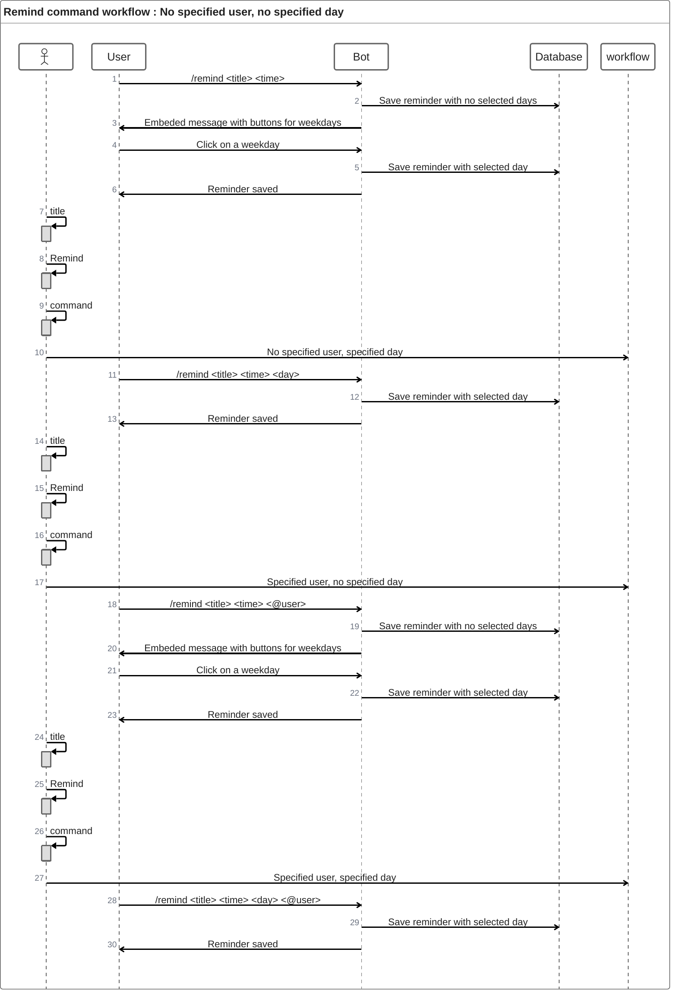

## Remind command workflow

```mermaid
zenuml
    title Remind command workflow : No specified user, no specified day
    User->Bot: /remind <title> <time>
    Bot->Database: Save reminder with no selected days
    Bot->User: Embeded message with buttons for weekdays
    User->Bot: Click on a weekday
    Bot->Database: Save reminder with selected day
    Bot->User: Reminder saved
    
    title Remind command workflow : No specified user, specified day
    User->Bot: /remind <title> <time> <day>
    Bot->Database: Save reminder with selected day
    Bot->User: Reminder saved
    
    title Remind command workflow : Specified user, no specified day
    User->Bot: /remind <title> <time> <@user>
    Bot->Database: Save reminder with no selected days
    Bot->User: Embeded message with buttons for weekdays
    User->Bot: Click on a weekday
    Bot->Database: Save reminder with selected day
    Bot->User: Reminder saved
    
    title Remind command workflow : Specified user, specified day
    User->Bot: /remind <title> <time> <day> <@user>
    Bot->Database: Save reminder with selected day
    Bot->User: Reminder saved
```